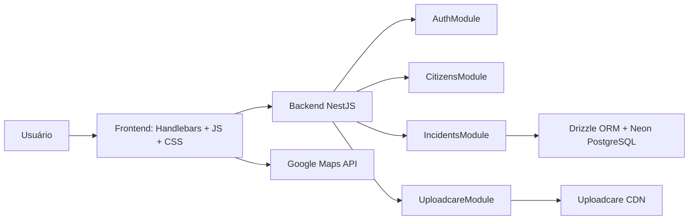

# Arquitetura do projeto

## Visão geral

O Quadro de Avisos é uma aplicação web full-stack composta por:

- **Frontend**: página única server-rendered com Handlebars, JavaScript vanilla, CSS e Google Maps.
- **Backend**: API REST em NestJS (Express) com autenticação JWT.
- **Banco de dados**: PostgreSQL via Neon, acessado pelo Drizzle ORM.
- **Armazenamento de imagens**: Uploadcare CDN.

## Camadas

1. **Apresentação** (`views/`, `public/`): a página inicial (`home.hbs`) carrega o mapa e os modais; o comportamento dinâmico fica em `public/js/home.js`.
2. **Aplicação** (`src/*`): controllers, services, guards e decorators NestJS.
3. **Domínio** (`src/incidents/`, `src/citizens/`, `src/common/lib/criticality.ts`): entidades, enum de criticidade e regras de negócio.
4. **Dados** (`src/database/`): schemas Drizzle, conexão Neon e migrations.

## Componentes principais

### Frontend

- Renderiza a página principal com Handlebars.
- Carrega o mapa via Google Maps JavaScript API.
- Gerencia marcadores, clusters, seleção de pontos, modais e formulários.
- Comunica-se com o backend via `fetch` (REST).
- Armazena sessão JWT e filtros no `localStorage`.
- Registra service worker para funcionar como PWA.

### Backend

- Inicia a aplicação NestJS/Express.
- Serve arquivos estáticos e a view principal.
- Expõe endpoints de autenticação, cidadãos, ocorrências e upload.
- Aplica `AuthGuard` global com exceções de paths públicos.
- Valida permissões de criação, edição, aprovação e remoção de ocorrências.

## Modelo de dados resumido

- `Citizen`: usuário cadastrado com CPF, senha hash, perfil, role (`user`/`admin`) e `anonId`.
- `Incident`: ocorrência com localização, criticidade, status (`reviewed`, `active`), fotos vinculadas e metadados.
- `UploadcareFile`: registro de arquivos enviados ao Uploadcare, vinculados a uma ocorrência.

## Observações

- A criticidade é um **enum TypeScript/PostgreSQL**, não uma entidade persistida.
- O frontend é atualmente um único arquivo JavaScript grande (`public/js/home.js`); a manutenção pode ser facilitada com modularização futura.
- Datas trafegam em UTC entre frontend e backend para evitar problemas de fuso.
