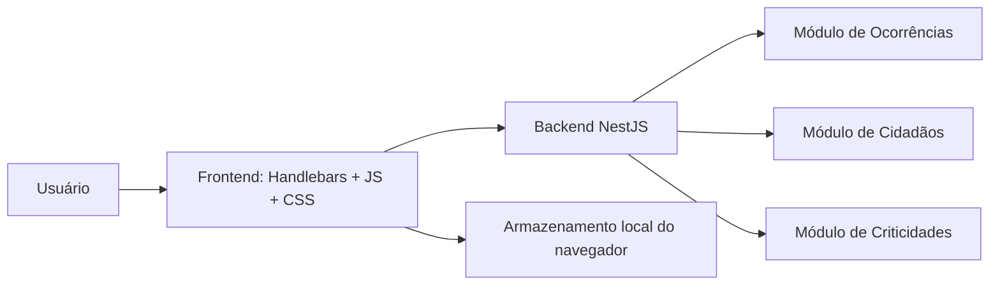

# Arquitetura do projeto

## Visão geral da arquitetura

A aplicação segue uma arquitetura simples, com separação entre:
- camada de apresentação (frontend);
- camada de aplicação (backend NestJS);
- camada de domínio (módulos de ocorrências, cidadãos e criticidades).

## Componentes principais

### Frontend
- Renderiza a página principal com Handlebars.
- Carrega o mapa via Google Maps JavaScript API.
- Gerencia os marcadores, seleção de pontos e formulário de criação.
- Usa arquivos estáticos em public/css e public/js.

### Backend
- Responsável por iniciar a aplicação e servir a view principal.
- Organiza o projeto em módulos.
- Expõe controladores para operações relacionadas a ocorrências, cidadãos e criticidades.

## Observação importante

O fluxo atual do protótipo é principalmente frontend-driven. As ocorrências são criadas e persistidas no navegador por meio de localStorage, enquanto o backend permanece como estrutura base e lógica de domínio inicial.
